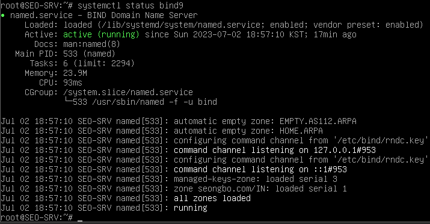

# 1학년 Linux 평가과제

[1학년 Linux 평가과제 문제지](Task/Linux-Task.md)

- VM 단축키
    
    ctrl + D = 설정창
    
    ctrl + alt ⇒ 클라이언트 창 빠져나옴
    
    ctrl + tap ⇒ 다음창으로 넘김
    
    ctrl + g ⇒ 클라이언트 창
    
1. 토폴리지대로 클라이언트를 생성한다.

ip 와 DNS를 할당한다.

```jsx
vim /etc/network/interfacesF
```

```jsx
auto ens32
iface ens32 inet static
					address XXX.XXX.XXX.XXX/24
					gateway XXX.XXX.XXX.XXX
```

```jsx
vim /etc/hosts
```

```jsx
:%s:devian:SEO-SRV.seongbo.com SEO-SRV
:wq
```

```jsx
hostnamectl set-hostname SEO-SRV
```

```jsx
systemctl restart networking
```

2.모든 비밀번호를 Skill39로 설정한다.

```jsx
echo -e "Skill39\nSkill39" | passwd root
echo -e "Skill39\nSkill39" | passwd sysop
```

### DNS

- DNS란?
    
    IP 네트워크에서 사용하는 시스템이다. 우리가 인터넷을 편리하게 쓰게 해주는 것으로, 영문/한글 주소를 IP 네트워크에서 찾아갈 수 있는 IP로 변환해준다
    
    모든  웹 사이트 주소를 도메인 대신 아이피로 외운다고 생각하면 생각 하기도 싫다.
    
    이 DNS를 운영하는 서버를 네임서버라고 한다. nslookup 명령어의 ns가 Name server다.
    

```jsx
apt intsall -y bind9
```

```jsx
vim /etc/bind/named.conf
```

```jsx
zone "seongbo.com" {
		type master
		file seo.zone
		allow-update { any; };
};
```

```c
vim /etc/bind/named.conf.options
```

13, 14, 15 번 줄 주석 해제

```c
13 forwarders {
14				172.16.0.1;
15 };
```

```c
21 dnssec-validation no;
22 allow-query { any; };
23 allow-recursion { any; };
24 listen-on-v6 { any; };
```

```c
cd /var/cache/bind/
cp /etc/bind/db.0 ./seo.zone
vim ./seo.zone
```

```c
:%s:localhost:SEO-SRV.seongbo.com:g

13 SEO-SRV A 192.168.0.1
14 www CNAME SEO-SRV
```

```c
named-checkconf
```

아무것도 안뜨면 정상

```c
systemctl restart bind9

systemctl status bind9
```



위와 같이 나오면 정상

```c
vim /etc/resolv.conf
```

```c
nameserver 192.168.0.1
search seongbo.com
domain seongbo.com
```

host [도메인] 으로 점검

### DAE-SRV

```c
apt install -y bind9

vim /etc/bind/named.conf
```

11번 줄 주석 해제

```c
view int {
        match-clients { 172.16.0.0/24; localhost; };
        zone "daeseong.com" {
                  type master;
                  file "int.zone";
        };
};

view ext {
         match-clients { any; };
         zone "daeseong.com" {
                 type master;
                 file "ext.zone";
         };
};
```

```c
vim /etc/bind/named.conf.options
```

```c
13 forwarders {
14        192.168.0.1;
15 };

21 dnssec-caildation no;
22 allow-recursion { any; };
23 allow-query { any; };
```

```c
cp /etc/bind/db.0 /var/cache/bind/int.zone
cp /etc/bind/db.0 /var/cache/bind/ext.zone
```

tip: sed -i “s/localhost/DAE-SRV.daeseong.com/g” /var/cache/bind/*.zone

위 코드는 %s:localhost:DAE-SRV.daeseong.com:g를 /var/cache/bind/ 안에 있는 .zone로 끝나는 파일 모두에 적용해라 라는 뜻

```c
vim /var/cache/bind/int.zone
```

```c
13 DAE-SRV A 172.16.0.1
14 www CNAME DAE-SRV
15 ftp CNAME DAE-SRV
```

```c
vim /var/cache/bind/ext.zone
```

```c
13 DAE-SRV A 117.121.24.150
14 www CNAME DAE-SRV
15 ftp CNAME DAE-SRV
```

named-checkconf(아무것도 안뜨면 정상)

```c
systemctl restart bind9

systemctl status bind9
```


위와 같이 뜨면 정상

```c
vim /etc/resolv.conf

1 nameserver 172.16.0.1
search daeseong.com
domain daeseong.com
```

host [도메인]으로 점검

---

## DHCP

- DHCP란?
    
    **D**ynamic **H**ost **C**onfiguration **P**rotocol
    직역하자면 ‘동적 호스트 설정 프로토콜(통신규약)’이다.
    
    IP를 필요로 하는 컴퓨터에게 자동으로 할당해서 사용할 수 있도록 해주고, 사용하지 않으면 반환받아 다른 컴퓨터가 사용할 수 있도록 해주는 것이 DHCP이다.
    

### SEO-R

```c
apt install -y isc-dhcp-server

vim /etc/dafault/isc-dhcp-server
```

17 번줄 “ens32”

```c
vim /etc/dhcp/dhcpd.conf
7 option domain-name "seongbo.com;
8 option domain-name-servers 192.168.0.1;

17 ddns-update-style standard;
18 zone seongbo.com {
19         primary 192.168.0.1;
20 };
```


```c
systemctl restart isc-dhcp-server
```

### DAE-R

```c
apt intstall -y isc-dhcp-server

vim /etc/default/isc-dhcp-server
```


```c
vim /etc/dhcp/dhcpd.conf
```


LINE 38


```c
systemctl restart isc-dhcp-server
```

---

## Site to Site VPN

- VPN 이란?
    
    공공 인터넷을 통해 가상의 사설 네트워크를 구성하여 프라이빗 통신을 제공하는 기술로 데이터 암호화, 전용 연결 등 여러 보안 요구 사항을 충족할 수 있다.
    
- Site-to-Site VPN 이란?
    
    두 개의 네트워크 도메인이 가상의 사설 네트워크 연결을 사용하여 프라이빗 통신을 가능하게 라는 서비스로 표준 IPSec VPN만 지원한다.
    

### SEO-R

```c
apt install -y strongswan

vim /etc/ipsec.conf
```


```c
vim /etc/ipsec.secret
```


```c
systemctl restart strongswan
```

### DAE-R

```c
apt install -y strongswan

vim /etc/ipsec.conf
```


```c
vim /etc/ipsec.secrat
```


```c
systemctl restart strongswan
```

---

## CA

- CA란?
    
    먼저 SSL과 보안 인증서에 대해 간략히 알아보자
    
    SSL (보안 소켓 계층)이란?
    
    SSL(Secure Sockets Layer)은, 일반적으로 서버의 웹사이트와 클라이언트의 브라우저 간의 통신 시에 데이터를 암호화 해주는 프로토콜을 말한다.
    SSL 통신을 하면 브라우저의 주소 창 위에 http 가 아닌 https 로 표시가 된다.
    
    우리나라 개인정보 보호법에 따르면 개인정보를 포함하고 있는 사이트(본인인증이 필요한 사이트)라면 반드시 적용이 되야 한다.
    
    ---
    
    - 그럼, TLS는 무엇일까?
    
    SSL의 버전이 올라가면서 명칭이 TLS로 변경되었지만 기존의 SSL이라는 명칭을 계속 쓰고 있다.
    SSL = TLS 대부분의 브라우저에는 TLS 1.2 이상의 버전을 권고하고 있다.
    
    ---
    
    SSL 보안 인증서란?
    
    보안 인증서는 기본적으로 개인 키와 공개 키로 이루어져 있습니다.
    
    개인 키는 비공개 키로 암호화 또는 복호화 하는데 사용이 됩니다. 공개 키는 누구나 볼 수 있는 정보지만 해당 키는 신뢰할 수 있어야 하며, 이것을 증명해주고 발급 해주는 기관이 인증 기관, CA(Certificate Authority)라고 한다. 공개 키중 CA 정보를 가지고 있는 인증서들이 있으며 루트 인증서, 중간 인증서라고 한다.
    
    ---
    
    인증기관(Certificate Authority, CA) 이란?
    
    
    
    SSL 인증서를 발급 해주는 인증 기관은 여러 곳이 있다. 대표적으로는 Sectigo(comodo), Digicert, GlobalSign, Let’s Encrypt 등이 있다.
    
    동일한 등급에 같은 유형의 인증서라면 서명 알고리즘 및 암호화 강도 등은 대부분 동일하며,
    
    앞에 설명한 것과 같이 대부분의 브라우저와 OS에 CA인증서들이 저장되어 있어 호환성에서도 큰 차이는 없습니다.
    
    *다만, 오래된 버전의 OS를 사용하거나 인증 기관과 통신이 되지 않는 패쇄망 환경에서 인증서를 갱신하게 될 경우 루트 및 중간 인증서가 업데이트 되었다면, 클라이언트 측의 저장소의 루트 및 중간 인증서는 업데이트가 되지 않아 신뢰를 하지 않을 수 있기 때문에 문제가 될 수 있습니다.*
    

### SEO-SRV

```c
vim /etc/ssl/openssl.cnf
```


```c
vim /usr/lib/ssl/misc/CA.pl
```


user_cert = 유저 인증서

v3_req = 서버 인증서

v3_ca = 하위기관 인증서

```c
/usr/lib/ssl/misc/CA.pl -newca
Commin Name = SEO-CA
password: Skill39
```

---

## LDAP

- LDAP란?
    
    LDAP(Lightweight Directory Access Protocol)는 사용자가 조직, 구성원 등에 대한 데이터를 찾는 데 도움이 되는 프로토콜입니다. LDAP는 LDAP 디렉터리에 데이터를 저장하고 사용자가 디렉터리에 액세스할 수 있도록 인증하기 위해 주로 사용됩니다. 또한 애플리케이션이 디렉터리 서비스와 정보를 주고 받는 데 필요한 통신 언어를 제공합니다. 디렉터리 서비스는 네트워크 내에서 조직, 개인 및 기타 데이터에 대한 정보가 있는 *위치*에  액세스할 권한을 제공합니다.
    
    가장 일반적인 LDAP 활용 사례는 디렉터리 서비스에 액세스하여 해당 서비스를 관리할 수 있는 중앙 위치를 제공하는 것입니다. LDAP를 사용하는 조직은 조직, 조직의 사용자, 자산(Ex: 사용자 이름, 암호)에 대한 정보를 저장, 관리, 보호할 수 있습니다. LDAP는 정보 계층 구조를 제공하여 스토리지 액세스를 간소화하는 데 도움이 되고, 기업이 성장하면서 더 많은 사용자 데이터와 자산을 확보함에 따라 중요할 수 있습니다.
    
    LDAP는 Kerveros 및 SSO(Singke Sign-On), SASL(Simple Authentication Security Layer), SSL(Secure Sockets Layer) 지원을 포함하여 사용자 인증을 목표로 identity 및 액세스 관리(IAM) 솔루션 역할을 하기도 합니다.F
    

### SEO-SRV

User 생성

```c
echo -e "Skill39\nSkill39" | adduser -gecos '' user01

apt install -y slapd migrationtools
*password : Skill39

vim /etc/ldap/ldap.conf
```


```c
cd /usr/share/migrationtools

vim migrate_common.ph
```


```c
vim migrate_base.pl
```


```c
vim migrate_passwd.pl  
```


```c
cp ./migrate_common.ph /usr/share/perl5/
./migrate_base.pl > ou.ldif
./migrate_passwd.pl /etc/passwd > passwd.ldif
vim ou.ldif
```


tip roc 이라고 써져있는걸 찾는게 빠르다 shift v활용

```c
vim passwd.ldif
```


tip : user01 빼고 다 지운다

```c
ldapadd -cWD cn=admin,dc=seongbo,dc=com -f passwd.ldif
ldapadd -cWD cn=admin,dc=seongbo,dc=com -f ou.ldif
```

```c
ldapsearch -x
```


### DAE-SRV

```c
echo -e 'Skill39\nSkill39' | adduser -gecos '' user01

apt install -y slapd migrationtools
*password : Skill39

vim /etc/ldap/ldap.conf
```


```c
cd /usr/share/migrationtools
vim migrate_common.ph
```


```c
vim migrate_base.pl
```


```c
vim migrate_passwd.pl
```


```c
cd /usr/share/migrationtools

cp ./migrate_common.ph /usr/share/perl5/
./migrate_base.pl > ou.ldif
./migrate_passwd.pl /etc/passwd > passwd.ldif
vim ou.ldif
```


```c
vim passwd.ldif
```


```c
ldapadd -cWD cn=admin,dc=daeseong,dc=com -f passwd.ldif
ldapadd -cWD cn=admin,dc=daeseong,dc=com -f ou.ldif
```

```c
ldapsearch -x
```


---

## Web Server

- Web Server
    1. 웹 서버: 웹 브라우저와 같은 클라이언트로부터 HTTP 요청을 받아드리고, HTML 문서와 같은 웹페이지를 반환하는 컴퓨터 프로그램
    2. 웹 서버 (하드웨어): 위에 언급한 기능을 제공하는 컴퓨터 프로그램을 실행하는 컴퓨터
    
    웹 서버(Web server)는 HTTP 또는 HTTPS를 통해 웹 브라우저에서 요청하는 HTML 문서나 오브      젝트(이미지 파일 등)을 전송해주는 서비스 프로그램을 말한다. 웹 서버 소프트웨어를 구동하는 하드웨어도 웹 서버라고 해서 혼동하는 경우가 간혹 있다.
    

### SEO-SRV

```c
cd /etc/ssl
openssl req -out www-seo.req -newkey rsa2048 -nides -keyout www-seo.key
*common Name = www.seongbo.com
openssl ca -in www-seo.req -out www-seo.crt
openlls req -out www-dae.req -newkey rsa:2048 -nodes -keyout www-dae.key
*Common Name = www.daeseong.com
openssl ca -in www-dae.req -out www-dae.crt
apt install -y apache2 php
vim /etc/apache2/sites-available/default-ssl.conf
```


```c
a2ensite default-ssl.conf
a2enmod ssl
a2enmod authnz_ldap
rm /var/www/html/index.html
vim /var/www/html/index.php
```


```c
systemctl restart apache2
```

### SEO-CLI

```c
scp 192.168.0.1:/etc/ssl/CA/cacert.pem /
```


왼쪽 화살표 클릭


이상한 하드모양 클릭(root)


더블클릭후 체크박스 2개 체크후 ok

파이어폭스에서 [https://www.seongbo.com](https://www.seongbo.com/) 접속


id : user01 pw : Skill39 입력

### DAE-SRV

```c
openssl req -out www-dae.req -newkey rsa:2048 -nodes -keyout www-dae.key
*Common Name = www.daeseong.com
openssl ca -in www-dae.req -out www-dae.crt
scp 192.168.0.1:/etc/ssl/CA/cacert.pem /etc/ssl
scp 192.168.0.1:/etc/ssl/www-dae.* /etc/ssl
apt install -y apache2 php
vim /etc/apache2/sites-available/default-ssl.conf
```


```c
a2ensite default-ssl.conf
a2enmod ssl
a2enmod authnz_ldap
rm /var/www/html/index/html
vim /var/www/html/index.php
```


### DAE-CLI

```c
scp 192.168.0.1:/etc/ssl/CA/cacert.pem /
```

SEO-CLI와 같이 [설정](image.md)

[https://daeseong.com](https://daeseong.com) 접속후 id : user01 pw : Skill39

---

## Firewall

- Firewall(방화벽)이란?
    
    방화벽 또는 파이어월(firewall)은 미리 정의된 보안 규칙에 기반한, 들어오고 나가는 네트워크 트래픽을 모니터링하고 제어하는 네트워크 보안 시스템이다. 방화벽은 일반적으로 신뢰할 수 있는 내부 네트워크, 신뢰할 수 없는 외부 네트워크(Ex: 인터넷) 간의 장벽을 구성한다. 서로 다른 네트워크를 지나는 데이터를 허용하거나 거부하거나 검열, 수정하는 하드웨어나 소프트웨서 장치이다.
    

### DAE-R

```c
apt install -y iptables iptables-persistent
*yes 클릭
vim /ip.sh
```


```c
chmod 777 /ip.sh
```


위와 같이 뜨면 정상이다.

### Remote


왼쪽 톱니바퀴 클릭


ipv4클릭


메뉴얼 클릭후 아래와 같이 작성


터미널에서 쿼리 작동 확인

리모트는 대성접속 O 성보접속 X

### SEO-R

```c
apt install -y iptables iptables-persistent
*yes 클릭
vim /ip.sh
```


```c
chmod 777 /ip.sh
/ip.sh
```


---

### SEO-CLI

성보사이트와 대성사이트 모두 접속 가능해야 한다.

### DAE-CLI

대성사이트만 접속 가능하다.

### Remote

대성사이트만 접속 가능하다.

---

진짜 다 걸고 복붙한거 사진밖에 없습니다.

오타 감안해주세요^^
