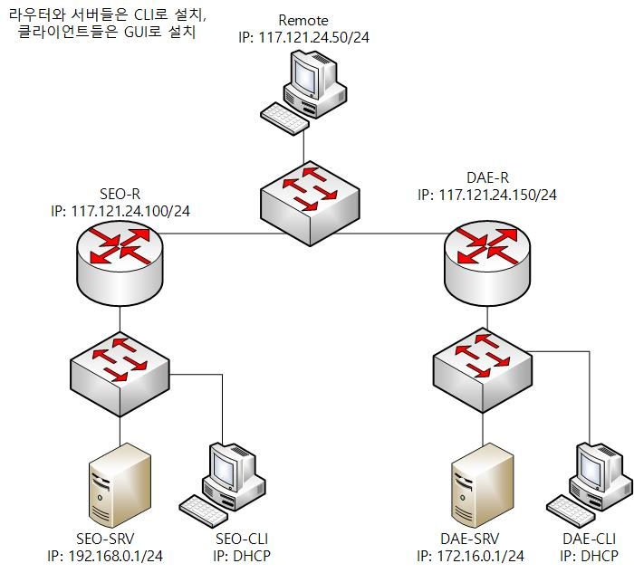

# 1학년 Linux 평가과제 문제지

## 1. 과제 개요

당신은 네트워크 엔지니어로 기업에서 필요하는 리눅스 환경을 구성해야합니다.

## 2. 주의 사항

- 지정되지 않은 사항은 기본 값을 사용하도록 합니다.
- 모든 비밀번호는 ‘Skill39’를 사용하도록 합니다.
- 대소문자를 명확히 구분합니다.
- 각 호스트의 컴퓨터이름은 토폴로지에 나와있는대로 지정합니다.

## 3.과제 내용

### 1.운영체제 설치 및 네트워크 구성

- 부록의 토폴리지를 참고하여 운영체제를 설치하도록 합니다.
- 부록의 토폴리지 및 호스트 설정 표를 참고하여 네트워크를 구성하도록 합니다.

### 2. **DNS**

- SEO-SRV에 DNS 서비스를 구성합니다.

| Name | Record | Value | Zone |
| --- | --- | --- | --- |
|  | SOA | SEO-SRV | seongbo.com |
| SEO-SRV | A | 192.168.0.1 |  |
| www | CNAME | SEO-SRV |  |
| 전달자: 172.16.0.1 | daeseong.com |  |  |
- DAE-SRV에 내부 네트워크를 위한 DNS 서비스를 구성합니다.

| Name | Record | Value | Zone |
| --- | --- | --- | --- |
|  | SOA | DAE-SRV | daeseong.com |
| DAE-SRV | A | 172.16.0.1 |  |
| www | CNAME | DAE-SRV |  |
| ftp | CNAME | DAE-SRV |  |
| 전달자: 192.168.0.1 | seongbo.com |  |  |
- DAE-SRV에 외부 네트워크를 위한 DNS 서비스를 구성합니다.

| Name | Record | Value | Zone |
| --- | --- | --- | --- |
|  | SOA | DAE-SRV | daeseong.com |
| DAE-SRV | A | 117.121.24.150 |  |
| www | CNAME | DAE-SRV |  |
| ftp | CNAME | DAE-SRV |  |

### 3. **DHCP**

- SEO-R에 각각 DHCP를 구성합니다.
- 범위는 192.168.0.100~192.168.0.150입니다.
- SEO-R을 게이트웨이로 사용해야합니다.
- SEO-CLI는 해당 서버로부터 IP를 동적으로 할당받아야합니다.
- 클라이언트는 DNS 서버에 동적으로 A레코드를 업데이트 시킬 수 있어야 합니다.
- DAE-R에 각각 DHCP를 구성합니다.
- 범위는 172.16.0.100~172.16.0.150입니다.
- DAE-R을 게이트웨이로 사용해야합니다.
- DAE-CLI는 해당 서버로부터 IP를 동적으로 할당받아야합니다.
- 클라이언트는 DNS 서버에 동적으로 A레코드를 업데이트 시킬 수 있어야 합니다.

### 4. **Site-to-Site VPN**

- DAE-R과 SEO-R 간에 IKEv2를 사용하여 Site-to-Site VPN을 구성하도록 합니다.
- 인증방식은 pre-shared key 방식을 사용하고, 키 값은 ‘Skill39’를 사용합니다.
- 192.168.0.0/24과 172.16.0.0/24 네트워크간 모든 통신이 암호화되어야 합니다.

### 5. **Certificate Authority**

- SEO-SRV에 루트 인증기관을 구성하도록 합니다.
- 인증기관 이름은 “SEO-CA”를 사용합니다.
- “/etc/ssl/CA” 폴더에 인증기관 정보를 저장합니다.
- 해당 인증기관의 루트 인증서의 유효기간은 5년입니다.
- 모든 서비스에 필요한 인증서는 해당 인증기관에서 발급해야합니다.

### 6. **LDAP**

- SEO-SRV에 slapd 서비스를 구성하도록 합니다.
- 도메인 이름은 seongbo.com을 사용합니다.
- 부록의 Users 항목을 참고하여 LDAP 사용자를 생성합니다.
- SEO-CLI에서 LDAP 사용자를 이용해 로컬 로그인이 가능해야합니다.
- DAE-SRV에 slapd 서비스를 구성하도록 합니다.
- 도메인 이름은 daeseong.com을 사용합니다.
- 부록의 Users 항목을 참고하여 LDAP 사용자를 생성합니다.
- DAE-CLI에서 LDAP 사용자를 이용해 로컬 로그인이 가능해야합니다.

### 7. **Web Server**

- SEO-SRV에 [www.seongbo.com](http://www.seongbo.com/) 웹사이트를 구성합니다..
- 해당 사이트는 SEO-CA에서 발급받은 인증서를 사용해 암호화된 통신을 해야합니다.
- 해당 사이트에 접근시 “Welcome [로그인한 유저이름]!”이 출력되야 합니다.
- 해당 사이트에 접근시 LDAP 사용자로 인증이 가능해야 합니다.
- DAE-SRV에 [www.daeseong.com](http://www.daeseong.com/) 웹사이트를 구성합니다..
- 해당 사이트는 SEO-CA에서 발급받은 인증서를 사용해 암호화된 통신을 해야합니다.
- 해당 사이트에 접근시 “Welcome [로그인한 유저이름]!”이 출력되야 합니다.
- 해당 사이트에 접근시 LDAP 사용자로 인증이 가능해야 합니다.

### 8. **Firewall**

- DAE-R에 외부 호스트를 위한 포트 포워딩을 구성합니다.
- Remote가 [www.daeseong.com](http://www.daeseong.com/) 웹 사이트에 접근이 가능하도록 포트포워딩을 구성합니다.
- SEO-R에 방화벽을 구성합니다.
- DAE-CLI가 SEO-SRV의 http 사이트로 접근하지 못하도록 구성합니다.

## 4. 부록

### 1) USER

| Username | OU | Password | Domain |
| --- | --- | --- | --- |
| user01 | users | Skill39 | seongbo.com |
| user01 | users | Skill39 | daeseong.com |

### 2) 토폴리지

### 3) 호스트 설정 표

- SEO-SRV

호스트이름

---

SEO-SRV.seongbo.com

---

- SEO-CLI

호스트이름

---

SEO-CLI.seongbo.com

---

- SEO-R

호스트이름

---

SEO-R.seongbo.com

---

- DAE-SRV

호스트이름

---

DAE-SRV.daeseong.com

---

- DAE-R

호스트이름

---

DAE-R.daeseong.com

---

- DAE-CLI

호스트이름

---

DAE-CLI.daeseong.com

---

- Remote

호스트이름

---

Remote

---
